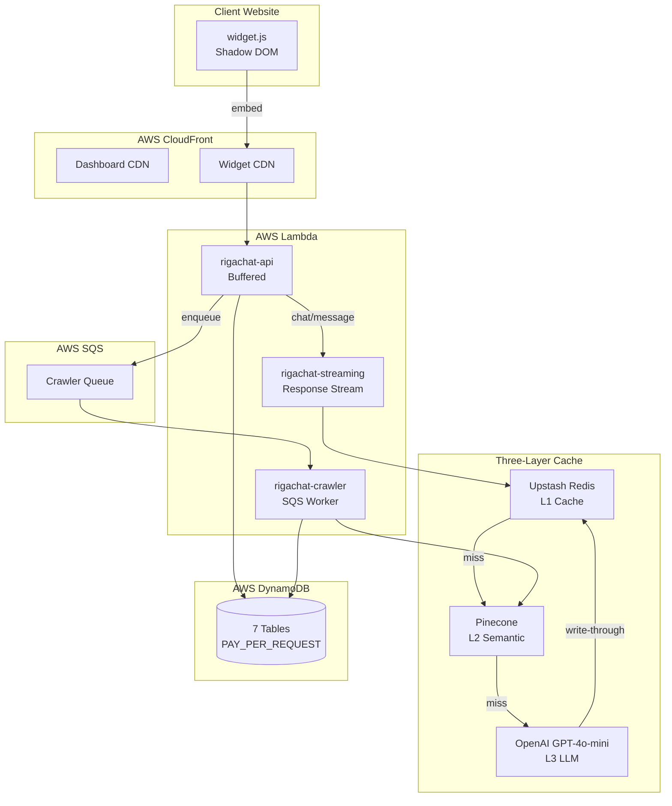

<div align="center">

# VyostraAI

> Deploy AI chatbots with a native CRM in 3 minutes. Built for Indian SMBs.

[](https://github.com/akvinayaktiwari/RigaChat/stargazers)
[](https://github.com/akvinayaktiwari/RigaChat/watchers)
[](https://github.com/akvinayaktiwari/RigaChat/commits/main)
[](https://github.com/akvinayaktiwari/RigaChat/actions/workflows/ci.yml)


 🇮🇳

[🚀 Live Demo](https://vyostra.com) · [📺 Follow the Build](https://github.com/akvinayaktiwari/RigaChat) · [📩 Request Early Access](mailto:support@vyostra.com?subject=VyostraAI%20Early%20Access)

</div>

---

## Elevator Pitch

Most chatbot tools either skip the CRM or cost a fortune. VyostraAI is the only platform that natively bundles an AI chatbot trained on your website with a built-in CRM — no Zapier, no third-party integrations, no enterprise pricing. Point it at a URL, it crawls, chunks, and embeds your content, and every conversation that follows lands as a qualified lead in your dashboard.

```
Website URL → AI Crawler → RAG Pipeline
                                ↓
Visitor chats → Lead captured → CRM
                                ↓
                WhatsApp notification → Client
```

## Comparison

| Feature               | VyostraAI  | Chatbase | Intercom |
|------------------------|------------|----------|----------|
| Native CRM             | ✅         | ❌       | ❌       |
| RAG on your content    | ✅         | ✅       | ❌       |
| WhatsApp integration   | ✅         | ❌       | ❌       |
| Indian pricing (INR)   | ✅         | ❌       | ❌       |
| Setup time             | 3 min      | 5 min    | Days     |
| Starting price         | ₹1,999/mo  | $40/mo   | $74/mo   |
| Built-in forms         | ✅         | ❌       | ❌       |

## Features

<table>
<tr>
<td width="50%" valign="top">

**🤖 RAG-Powered AI**
Crawls your website, chunks, embeds, retrieves. GPT-4o-mini + Pinecone, with MMR diversity so answers pull from more than one chunk.

**📊 Native CRM**
Every lead lands directly in the dashboard. No Zapier, no HubSpot subscription. Full chat transcript attached to each lead.

**💬 WhatsApp Notifications**
Instant WhatsApp alert to the client the moment a lead is captured. Gupshup powered.

**🎯 Sequential Lead Capture**
Name → Phone → Email, one field at a time. Required or optional per field, sparse payload — no garbage data.

</td>
<td width="50%" valign="top">

**📚 Knowledge Base**
Add FAQs, policies, product details as text entries embedded straight to Pinecone. KB-only bots need no website at all.

**🔌 Zoho CRM Integration**
One OAuth click, leads auto-sync with smart field mapping and non-retryable error handling.

**📝 Form Builder**
Embeddable lead forms for any page. Dynamic columns generated from field definitions, synced to the CRM automatically.

**⚡ Async Crawler Pipeline**
SQS job queue, parallel crawl, AI fact extraction per page, sitemap discovery with an HTML fallback.

</td>
</tr>
</table>

**🛡️ Shadow DOM Widget** — Zero CSS conflicts with the host site. XSS safe, fails silently, 4 trigger modes (immediate, delayed, scroll, exit-intent), streaming word-by-word responses.

**🔄 Three-Layer Cache** — L1 Redis exact match (~1ms, 7-day TTL) → L2 Pinecone semantic match (0.9 similarity threshold) → L3 OpenAI as the last resort. Write-through on every response.

## Tech Stack

**Frontend**


React Router v6, lucide-react icons, motion for animation.

**Backend**


esbuild for bundling, aws-jwt-verify for Cognito JWT validation.

**AI & Vector**


`text-embedding-3-small` embeddings, 1536 dimensions, cosine similarity, MMR retrieval.

**Infrastructure**


Two Lambda functions (buffered `rigachat-api` + streaming `rigachat-streaming`), DynamoDB (7 tables, PAY_PER_REQUEST), S3 + CloudFront (separate distributions for dashboard and widget CDN), Cognito, SQS, AWS KMS for credential encryption.

**Integrations**
Gupshup (WhatsApp), Zoho CRM

**DevOps**
GitHub Actions CI/CD, AWS CLI

## Architecture



## Quick Start

Local dev only — production runs on AWS Lambda behind Cognito, not documented here.

**Prerequisites**

- Node.js 22.x
- AWS CLI configured with credentials
- OpenAI API key
- Pinecone account (free tier works)
- Upstash Redis (free tier works)

```bash
git clone https://github.com/akvinayaktiwari/RigaChat.git
cd RigaChat

# Backend
cd backend
npm install
cp .env.example .env.local
# fill in your keys
npm run dev            # http://localhost:3000

# Frontend (new terminal)
cd frontend
npm install
cp .env.example .env.local
npm run dev
```

**Environment Variables**

| Variable | Required | Description |
|---|---|---|
| `OPENAI_API_KEY` | Required | Embeddings + chat completions |
| `PINECONE_API_KEY` | Required | Vector storage for RAG |
| `PINECONE_INDEX_NAME` | Required | Target Pinecone index |
| `AWS_REGION` | Required | Region for DynamoDB, Cognito, Lambda |
| `DYNAMODB_TABLE_CLIENTS` | Required | Clients table name |
| `DYNAMODB_TABLE_BOTS` | Required | Bots table name |
| `DYNAMODB_TABLE_LEADS` | Required | Leads table name |
| `DYNAMODB_TABLE_CONVERSATIONS` | Required | Conversations table name |
| `DYNAMODB_TABLE_KB` | Required | Knowledge base table name |
| `DYNAMODB_TABLE_FORMS` | Required | Form definitions table name |
| `DYNAMODB_TABLE_FORM_LEADS` | Required | Form-submitted leads table name |
| `COGNITO_USER_POOL_ID` | Required | JWT verification |
| `COGNITO_CLIENT_ID` | Required | JWT verification |
| `FRONTEND_URL` | Required | CORS origin |
| `ZOHO_CLIENT_ID` | Optional | Zoho CRM OAuth |
| `ZOHO_CLIENT_SECRET` | Optional | Zoho CRM OAuth |
| `ZOHO_REDIRECT_URI` | Optional | Zoho CRM OAuth callback |
| `SQS_CRAWLER_QUEUE_URL` | Required | Crawler job queue |
| `LAMBDA_FUNCTION_NAME` | Required | Buffered Lambda, used by deploy script |
| `LAMBDA_STREAMING_FUNCTION_NAME` | Required | Streaming Lambda, used by deploy script |
| `PORT` | Optional | Local dev server port (defaults to 3000) |
| `NODE_ENV` | Optional | `development` \| `production` |
| `VITE_API_URL` | Required | Backend URL for the frontend |
| `VITE_COGNITO_DOMAIN` | Required | Cognito hosted UI domain |
| `VITE_COGNITO_CLIENT_ID` | Required | Cognito app client ID |
| `VITE_COGNITO_REDIRECT_URI` | Required | Cognito OAuth redirect |
| `VITE_COGNITO_REGION` | Required | Cognito region |
| `VITE_CDN_URL` | Required | Widget CDN URL |

## Project Structure

```
RigaChat/
├── backend/src/
│   ├── routes/        ← HTTP handlers (thin)
│   ├── services/      ← All business logic
│   ├── repositories/  ← DB & external APIs
│   ├── lib/            ← Clients & utilities
│   ├── providers/      ← CRM + channel integrations
│   └── types/          ← TypeScript interfaces
├── frontend/src/
│   ├── pages/          ← Route-level components
│   ├── components/     ← Reusable UI + landing
│   └── services/       ← API service layer
├── frontend/public/
│   ├── widget.js        ← Embeddable chat widget (vanilla JS, zero deps)
│   └── form-widget.js   ← Embeddable lead form widget
└── .github/workflows/
    ├── ci.yml          ← Runs on every push
    └── deploy.yml      ← Runs on main only
```

## Roadmap

### ✅ Shipped
- [x] RAG pipeline (crawl → chunk → embed → retrieve)
- [x] MMR retrieval diversity
- [x] Three-layer cache (Redis → Pinecone → LLM)
- [x] Built-in CRM dashboard (8 pages)
- [x] Sequential lead capture widget
- [x] WhatsApp lead notifications
- [x] Zoho CRM integration
- [x] Form builder + embeddable forms
- [x] Async SQS crawler pipeline
- [x] AI suggested questions (chips)
- [x] KB-only bot flow (no website needed)
- [x] Support email auto-extraction
- [x] Landing page (VyostraAI design)
- [x] Interactive demo AI agent on landing

### 🔨 Building Now
- [ ] PDF/DOCX knowledge base upload
- [ ] Usage tracking + quota enforcement
- [ ] Razorpay subscription billing
- [ ] Automated test suite (Vitest + Playwright)

### 🗺️ Coming Soon
- [ ] VyostraAI production domain launch
- [ ] Puppeteer crawler (SPA support)
- [ ] HubSpot CRM integration
- [ ] Meta Lead Ads integration
- [ ] White label agency tier
- [ ] Analytics dashboard
- [ ] MCP server for client onboarding

## 👀 Following the Build

This product is being built in public. Watch the repo to follow the journey from zero to production SaaS.

- ⭐ Star the repo to follow progress
- 👀 Watch for build updates
- 🐦 Follow [@akvinayaktiwari](https://twitter.com/akvinayaktiwari) on Twitter/X for daily updates

> This repo will go private after the production launch.

## 👨‍💻 Built by

**Vinayak Tiwari** — Solo founder, building VyostraAI from zero to production in public.

[GitHub](https://github.com/akvinayaktiwari) · [Twitter/X](https://twitter.com/akvinayaktiwari) · [LinkedIn](https://linkedin.com/in/akvinayaktiwari)

---

<p align="center">
Built with ☕ in India 🇮🇳
<br/>
© 2026 VyostraAI, a product of Aashirwad Trading Enterprises
</p>
